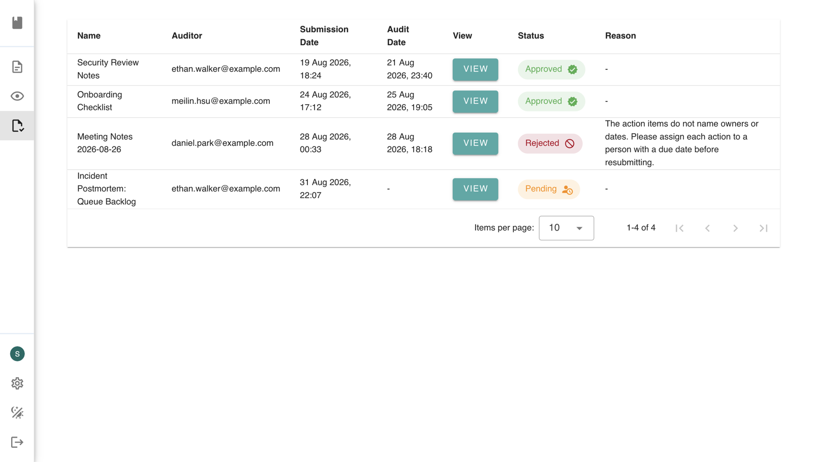
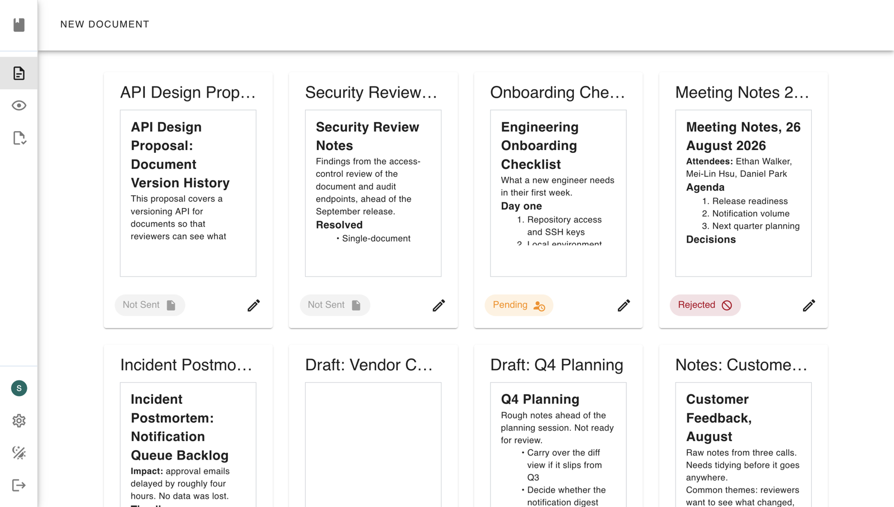
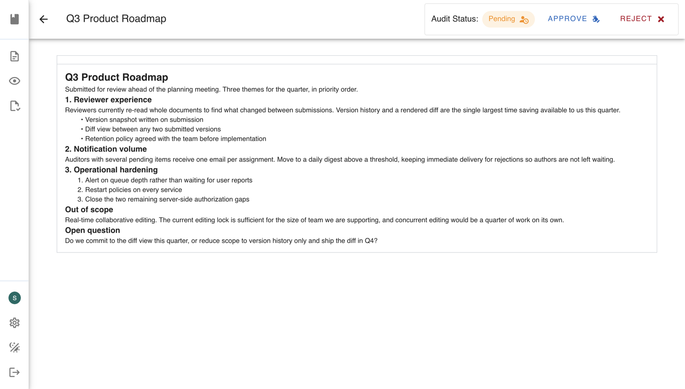
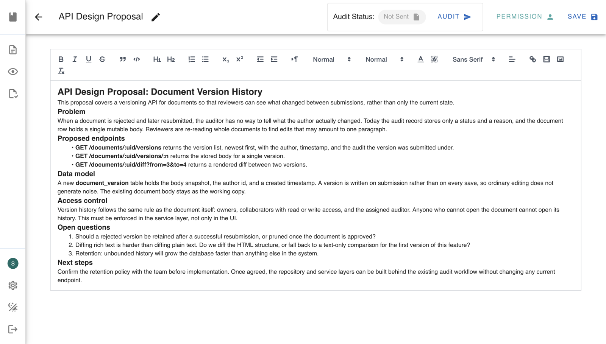
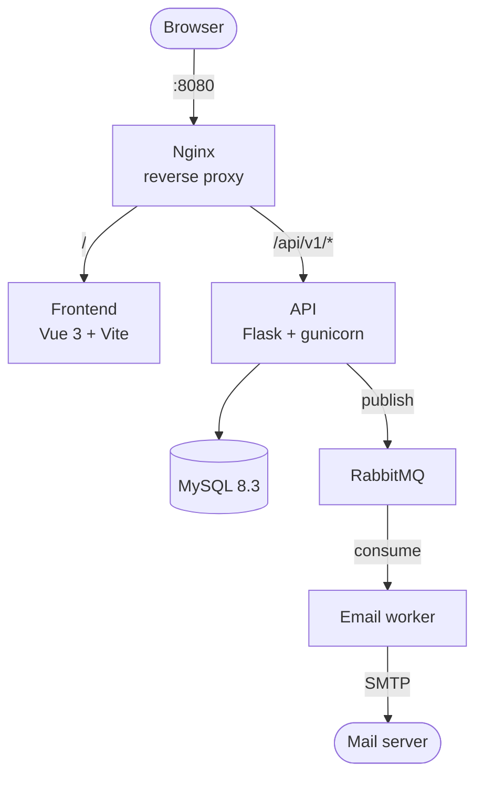

# Document Review & Approval Platform


> A collaborative document review platform. Write a document, share it with
> read or write access, then submit it for approval so an assigned auditor can
> approve or reject it with a reason. Email notifications are delivered
> asynchronously through a message queue.



---

## Features

- **Shared rich-text documents**: a Quill editor with inline comments. A database-backed editing lock stops two people overwriting each other; this is not real-time co-editing.
- **Per-document permissions**: grant any user read or write access to a specific document; the owner keeps full control.
- **Multi-stage approval workflow**: submit a document to a chosen auditor, who reviews it read-only and approves or rejects it with a written reason. Rejected documents stay editable and can be resubmitted.
- **Two review perspectives**: *Audits* lists documents assigned **to you** as auditor; *Reviews* lists the status of documents **you can access**.
- **Google sign-in**: OAuth 2.0, no password storage.
- **Asynchronous email notifications**: the API publishes to RabbitMQ and a separate worker delivers the mail, so a slow SMTP server never blocks a request.
- **AI writing assistance**: OpenAI-backed content suggestions inside the editor.



*Everything you own or collaborate on, each card carrying its current review status.*



*An auditor opens a submitted document read-only, and approves or rejects it from the toolbar.*



*The owner's view: rich-text editing, with submission, permissions, and save alongside.*

---

## Architecture

### Development topology

Six containers on one private Docker network. Nginx is the only service published
to the host. Production differs: Caddy becomes the public entry point and
terminates TLS, Nginx serves the compiled frontend rather than proxying to Vite,
and the frontend container is not run at all. See **Production Stack** below.



The backend follows a layered structure of **controller → service → repository →
model**, which keeps HTTP concerns, business rules, and data access separated.

| Layer | Directory | Responsibility |
|---|---|---|
| Controller | `system/controller/` | Routing, request validation, JSON responses |
| Service | `system/service/` | Business rules, permission decisions |
| Repository | `system/repo/` | Database queries |
| Model | `system/model/` | SQLAlchemy table definitions |

---

## Tech Stack

| Area | Technologies |
|---|---|
| **Frontend** | Vue 3.4, TypeScript 5.4, Vuetify 3.6, Pinia, Vue Router 4, Vite 5, Quill |
| **Backend** | Python 3.10, Flask 3.0, Flask-SQLAlchemy 3.1, marshmallow, Flask-Admin, gunicorn 22 |
| **Data** | MySQL 8.3, PyMySQL |
| **Messaging** | RabbitMQ 3.13, pika |
| **Auth** | Google OAuth 2.0 (`google-auth-oauthlib`) |
| **AI** | OpenAI API |
| **Infrastructure** | Docker Compose (6 services), Nginx, Caddy (automatic TLS) |
| **Testing** | pytest, coverage |

---

## Quick Start

### Prerequisites

- **Docker Desktop**, or Docker Engine with Compose v2. Everything else runs in containers.
- **A Google OAuth 2.0 client**, required for sign-in. Setup steps are below.
- *(Optional)* a Gmail app password for email notifications, and an OpenAI API key for writing suggestions

### 1. Clone

```bash
git clone https://github.com/SL510457/DocumentSystem.git
cd DocumentSystem
```

### 2. Configure environment variables

```bash
cp .env.sample .env
```

Then edit `.env`. Every variable is documented inline in `.env.sample`; the
ones you must set to get the app running are:

| Variable | What it is |
|---|---|
| `SECRET_KEY` | Flask session signing key. Generate with `python3 -c "import secrets; print(secrets.token_hex(32))"` |
| `GOOGLE_CLIENT_ID` | From your Google OAuth client |
| `REDIRECT_URI` | `http://localhost:8080/api/v1/sign-in/callback` for local development |
| `MYSQL_ROOT_PASSWORD` | Any password. It is used both to create the database and to connect to it |

> **`.env` lives at the repository root**, next to `compose.yaml`. Docker Compose
> resolves `${...}` in `compose.yaml` from that location only.

### 3. Add your Google OAuth credentials

In the [Google Cloud Console](https://console.cloud.google.com/apis/credentials),
create an **OAuth 2.0 Client ID** of type *Web application*, add
`http://localhost:8080/api/v1/sign-in/callback` as an authorised redirect URI,
download the JSON, and save it as:

```
system/service/client_secret.json
```

This file is gitignored and excluded from Docker images, so it is never baked into a build.

### 4. Run

```bash
docker compose up --build
```

Open **http://localhost:8080**.

Seeding is off by default. To start with disposable demo data, set
`SEED_DUMMY_DATA=true` in `.env` for the first run.

> ⚠️ Seeding **drops every table on each start**. Leave it `false` for any
> environment whose data you want to keep.

---

## Usage

```bash
docker compose up -d          # start in the background
docker compose logs -f api    # follow the API logs
docker compose ps             # what is running
docker compose down           # stop and remove containers (data is kept)
docker compose down -v        # ⚠️ also deletes the database volume
```

Rebuild only when the recipe changes. Application code is bind-mounted, so
Python and Vue edits reload without one:

```bash
docker compose up -d --build          # everything
docker compose up -d --build api      # just one service
```

---

## Production Stack

A separate compose file runs the production configuration: gunicorn instead of
Flask's development server, the frontend compiled to static assets and served by
Nginx instead of the Vite dev server, Caddy terminating TLS with automatic
Let's Encrypt certificates, and no source-code bind mounts.

```bash
# set SITE_DOMAIN in .env to your domain (or "localhost" to test locally)
docker compose -f compose.prod.yaml up -d --build
```

| | Development | Production |
|---|---|---|
| Web server | Flask dev server | gunicorn, 5 workers |
| Frontend | Vite dev server (hot reload) | Static build served by Nginx |
| TLS | none | Caddy, automatic certificates |
| Source code | bind-mounted | baked into the image |
| Secrets | `.env` file | injected at run time, never in the image |

Because nothing is baked into the image, the host running the production stack
must hold both `.env` and `system/service/client_secret.json` before the stack
starts. `compose.prod.yaml` mounts the credentials file read-only at run time.

---

## Testing

```bash
docker compose exec api python -m pytest tests -v
```

With a coverage report:

```bash
docker compose exec api sh -c 'coverage run \
  --source=controller,service,repo,model,email_notification_system \
  -m pytest tests -q && coverage report'
```

Currently 58% across 1,149 statements. `coverage html` writes a browsable
report to `htmlcov/`.

---

## 📁 Project Structure

```text
├── compose.yaml              # development stack (6 services)
├── compose.prod.yaml         # production stack (gunicorn, static build, TLS)
├── .env.sample               # documented environment variables
├── docker/                   # one Dockerfile per service
│   ├── api/  caddy/  frontend/  mysql/  nginx/
├── frontend/                 # Vue 3 single-page application
│   └── src/
│       ├── views/            # Home, Document, Audit, Reviews, Settings, Landing
│       ├── router/  stores/  plugins/
├── system/                   # Flask backend
│   ├── controller/           # routes and request validation
│   ├── service/              # business logic
│   ├── repo/                 # database access
│   ├── model/                # SQLAlchemy models
│   ├── email_notification_system/   # RabbitMQ consumer
│   ├── nginx/                # nginx.conf (dev) and nginx.prod.conf
│   └── tests/                # pytest suite
└── k8s/                      # Kubernetes manifests from the original team project
```
